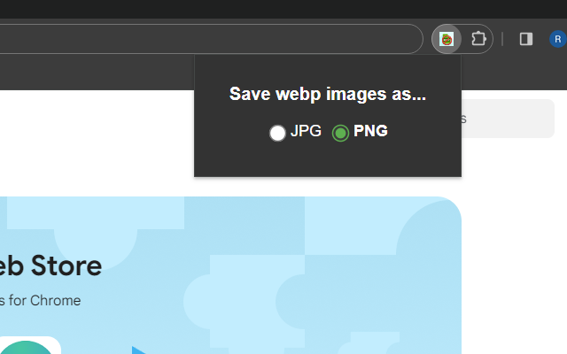
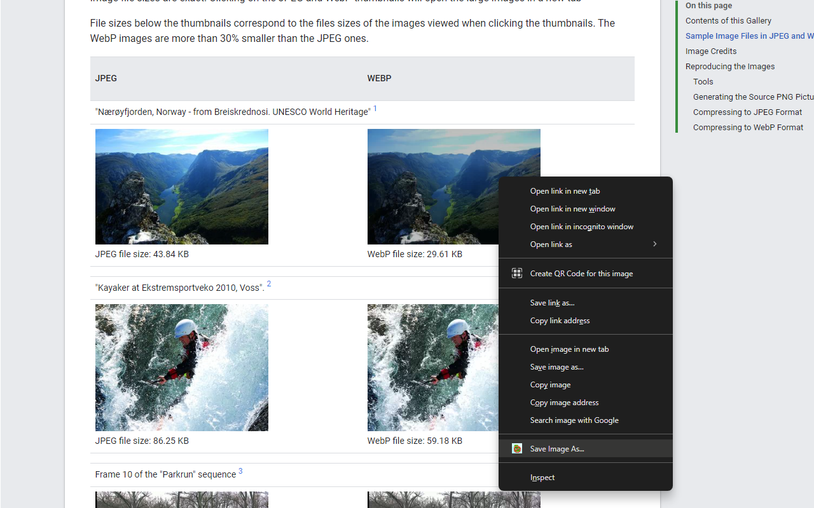

# Save WEBP as JPG/PNG - Chrome Extension

### Link to the Chrome extension
Install it from here: ```https://chromewebstore.google.com/detail/save-webp-as-jpgpng/dehibjkjchkomncipegajplehmgpodjn```


### Context
WebP is a format created by Google to make image load, on web pages, less costly and sizeable. That format can, however, be a nuissance to deal with in various image editing software.

### Purpose
Converts .webp images to either a JPG or PNG upon requesting it and allows you to save it, as you would any other image.

### How it works
1. Select which format you want to convert .webp images in (that option is saved through every session)



2. Right-click the image and select "Save Image As..." on the bottom


### Suggestions?
Open an issue here or leave it as a comment/review on the Chrome extension's page